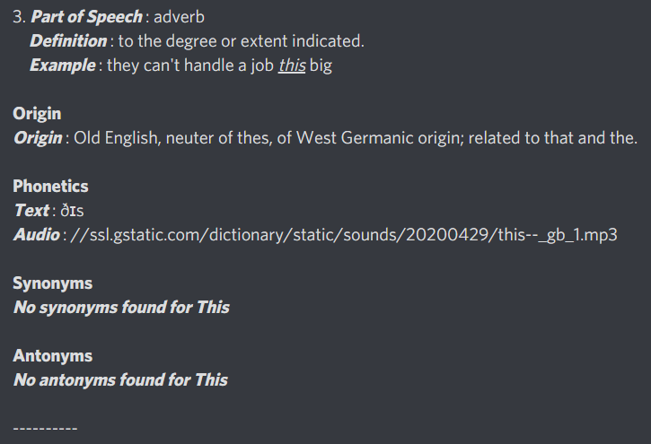

# Dictionary Bot 📚

##### -Pranav Agarwal

 

## About

A discord dictionary bot that gives the part of speech, definition, examples, origin, phonetics, synonyms and antonyms. This bot can take multiple inputs and gives the output for all the words after the command in a single message. A flask server is created to upload the discord bot on Repl.it and an uptime bot is used to ping the server every 5 minutes to ensure that the server does'nt go to sleep and the discord bot can be used anytime. The bot also checks if the message is more than 2000 (discord text limit) and splits the message and sends it accordingly. The bot shows the Menu when it is added to a new guild.
 

## Commands

| Command                       | Function                                                             |
| ----------------------------- | -------------------------------------------------------------------- |
| **/mean** <word1> <word2> ... | Gives the _part of speech, definition and examples._                 |
| **/org** <word1> <word2> ...  | Gives the _origin_ of the words.                                     |
| **/phon** <word1> <word2> ... | Gives the _phonetics text and audio_.                                |
| **/syn** <word1> <word2> ...  | Gives the _part of speech and the synonyms_ under them.              |
| **/ant** <word1> <word2> ...  | Gives the _part of speech and the antonyms_ under them.              |
| **/dict** <word1> <word2> ... | Gives the _short meaning, origin, phonetics, synonyms and antonyms_. |
| **/menu**                     | Gives the menu for the dictionary bot                                |
| **/slang**                    | Gives the _meaning and example_ for slangs.                          |

 

## Samples

1. Command : **/mean hello world**
    
   
     
2. Command : **/org helLo WorLd**
    
   
     
3. Command : **/phon i like cars**
    
   
     
4. Command : **/syn adfe walk rat**
    
   
     
5. Command : **/ant happy feet**
    
   
     
6. Command : **/dict riddle me this**
    
   
    
   
    
   
    
    

7. Command : **/slang wbu smh macha**
    
   
    
    

## How to use

- Click on the link provided below and login wih your discord account.
- Select the server/guild you want to add the bot to.
- Click on authorize to authorize the bot
- The bot will send the menu to the first text channel it is authorized for.
- The bot is ready for use.
   
  **Link** : https://bit.ly/3nqGiPW
